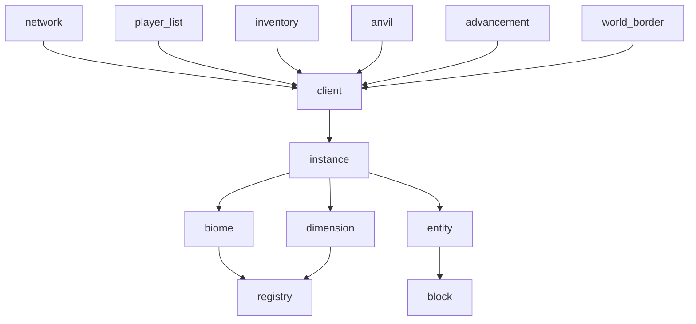

# Crates

The standard crates used in Valence projects.

All crates here are exported by the main `valence` crate. `valence` is the intended interface for both end users and plugin authors.

Crates are versioned in lockstep with the exception of `valence_nbt`.

Ignoring transitive dependencies and `valence_core`, the dependency graph can be described like this:

